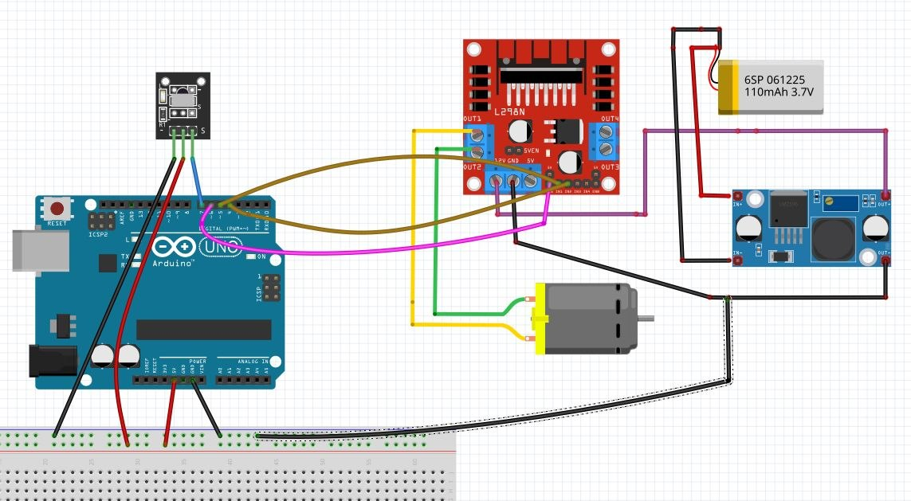

# Arduino IR Remote DC Motor Controller

This project enables remote control of a DC motor using an IR receiver and a standard IR remote with Arduino.

## 🛠 Features
- **Remote Control:** Forward, Backward, and Emergency Stop.
- **PWM Speed Control:** Adjustable speed from 60 to 255.
- **Serial Debugging:** Real-time feedback on IR codes and motor status.

## ⚙️ Circuit Connections
| Component | Arduino Pin |
|-----------|-------------|
| L298N ENA | D6 |
| L298N IN1 | D5 |
| L298N IN2 | D4 |
| IR Receiver | D7 |

## 💻 Hardware Requirements
- Arduino Uno
- L298N Motor Driver
- VS1838B IR Receiver
- NEC-compatible IR Remote

## 🖼 Circuit Diagram

## 🚀 How to Use
1. Upload `Arduino_IR_Remote.ino` to your Arduino.
2. Open Serial Monitor (Baud rate: 9600).
3. Press remote buttons and monitor the IR HEX codes in the Serial Monitor.
4. Replace the `KEY` definitions in the code with the HEX codes received from your specific remote.
